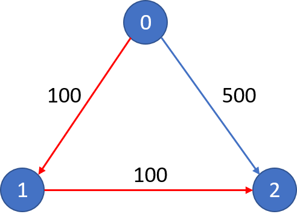

# 787.K 站中转内最便宜的航班
## 题目
&emsp;&emsp; 有 n 个城市通过 m 个航班连接。每个航班都从城市 u 开始，以价格 w 抵达 v。现在给定所有的城市和航班，以及出发城市 src 和目的地 dst，你的任务是找到从 src 到 dst 最多经过 k 站中转的最便宜的价格。 如果没有这样的路线，则输出 -1。

## 示例：
### **示例1**
>> **输入1：**
>> 
>>
>> n = 3, edges = [[0,1,100],[1,2,100],[0,2,500]]
>>
>> src = 0, dst = 2, k = 1
>>
>> **输出1：**
>>
>> 200


### **示例2**
>> **输入2：**
>>
>> 
>>
>> n = 3, edges = [[0,1,100],[1,2,100],[0,2,500]]
>> 
>> src = 0, dst = 2, k = 0
>>
>> **输出2：**
>>
>> 500

## hint
*  n 范围是 [1, 100]，城市标签从 0 到 n - 1.
*	航班数量范围是 [0, n * (n - 1) / 2].
*	每个航班的格式 (src, dst, price).
*	每个航班的价格范围是 [1, 10000].
*	k 范围是 [0, n - 1].
*	航班没有重复，且不存在环路


## 题解：

```C
class Solution {
public:
    int findCheapestPrice(int n, vector<vector<int>>& flights, int src, int dst, int K) {
        vector<vector<int>> dp(K + 2, vector<int>(n, 1e9));
        dp[0][src] = 0;
        for (int i = 1; i <= K + 1; ++i) {
            dp[i][src] = 0;
            for (auto x : flights) {
                dp[i][x[1]] = min(dp[i][x[1]], dp[i - 1][x[0]] + x[2]);
            }
        }
        return (dp[K + 1][dst] >= 1e9) ? -1 : dp[K + 1][dst];
    }
};
```
